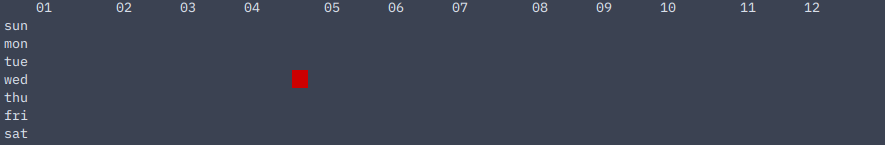
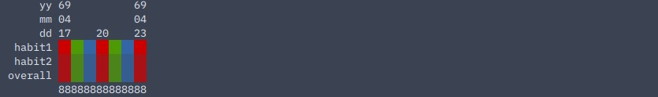

# map
this page will explain the "habit" command.

to refer to the definition/description of any value type, see [commands](index.html/#value-types).

## -d, --day
usage:`hbmp map -d [start] [end] ([colors])` 

displays a single bar of each habit's data from [start] to [end] as well as the overall completion of each day's habits, optionally in [colors].

example with 4-step habit1 and 3-step habit2 on 1969-4-20:
```
$ hbmp habit -t tdy
    habit1? (4) 4
    value of habit habit1 on 1969-4-20 changed to 4 of 4.
    habit2? (3) 2
    value of habit habit2 on 1969-4-20 changed to 2 of 3 (3 in 4-step).

$ hbmp map -d tdy tdy
         yy 69
         mm 04
         dd 20
     habit1 ██
     habit2 ▓▓
    overall ▓▓
            88
```

| value | type |
| ----- | ---- |
| start, end | any day/month/year |
| colors | any number of colors |

## -b, --bydur
usage: `hbmp habit -b [start] [end] [duration] ([colors])`

displays a single bar of each habit's data from [start] to [end] based on average for every [duration], optionally in [colors].

output is similar to [ -d | --day](#-d---day).

| value | type |
| ----- | ---- |
| start, end | any day/month/year |
| duration | 'week', 'month', or 'year'
| colors | any number of colors |

## -y, --year

usage: `hbmp map -y [year] [habit] ([colors])`

displays a calendar heatmap of the data in [habit] for [year], optionally in [colors].

example with 4-step habit1:
```
$ hbmp habit -t tdy habit1 4
    value of habit habit1 on 1969-4-20 changed to 4 of 4.

$ hbmp map -y 1969 habit1
        01        02      03      04        05      06      07        08      09      10        11      12
    sun                                                                                                           
    mon                                                                                                           
    tue                                                                                                           
    wed                                 ██                                                                        
    thu                                                                                                           
    fri                                                                                                           
    sat                                                                                                           
```
| value | type |
| ----- | ---- |
| habit | habit |
| year  | year  |
| colors | any number of colors |

## colors
it has been specified that here, a color can be any hex code (without preceding '#'), any [custom color name](https://shuu-wasseo.github.io/habitmap-docs/configuration.html#custom-colors) any 4-bit color, but the optional parameter ([colors]) is a bit more complicated than just that.

let's use the example in [ -y | --year](#-y---year), but switch it up a little.
```
$ hbmp habit -t tdy habit1 4
    value of habit habit1 on 1969-4-20 changed to 4 of 4.

$ hbmp map -y 1969 habit1 red
```

as you can see, the one square is now red.
while this is the basic use of the ([colors]) parameter, we can still take this to another level.

colors can also take as many arguments as you would like. if there are multiple arguments, each column will be the same color, and the order of the colors is the same order in which they would be entered.

if there are more columns than colors given, the colors will then repeat themselves in the same sequence over and over again.

let's follow up to the example in [ -d | --day](#-d---day) this time, but imagine you have committed to the habits at the same rate for all 7 days of that week.
```
$ hbmp map -d sun sat red green blue
```

as you can see, the red-green-blue pattern repeats until there are no more columns left.

if there are less columns than colors given, the last colors with no columns will simply be ignored.
